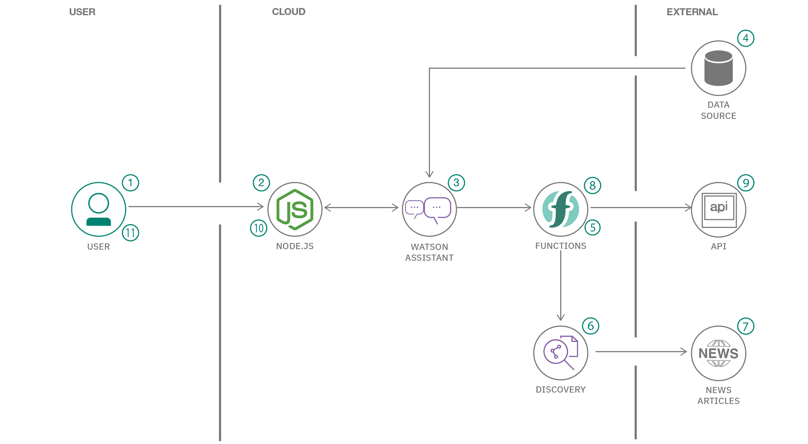

In times of crisis, communications systems are often overwhelmed with people trying to find basic information about testing, symptoms, community response, and other resources. When communication lines get clogged, people who need real help can’t get through. Chatbots help respond to tens, even hundreds of thousands of messages a day. 

AI-enabled resources can play a critical role in helping communities quickly understand crucial information and free up customer service resources to focus on higher-level issues.

It can:

1) Respond by sharing consistent, accurate COVID-19 information.

2) Help citizens quickly and easily access the latest information.

3) Free valuable resources by automating answers to common COVID-19 questions.

4) Dynamically update information with the latest developments and recommendations.
 

 Languages Used :

     BackEnd - Python

     FrontEnd - HTML, CSS, JavaScript

     Bootstrap Framework
     
 Fight corona Chatbot Assistant built using *IBM Cloud Services*.
 
 Visit the website using the following link : http://covidinfohub.pythonanywhere.com/
 
 A few screenshots of the website have also been attached. Check it out!
 
 
Follow the below instructions carefully:

1) Create a folder.

2) Paste ONLY app.py in that folder.

3) Create a new folder in that folder and call it 'templates', any other name won't work.

4) Paste all the html files in that folder.

Happy Coding!

****Architecture: 

